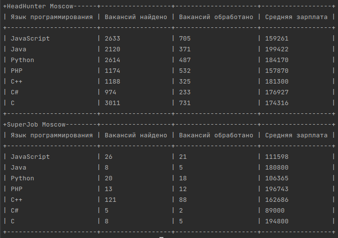

# Job_selection_service

We will compare developer vacancies in different programming languages from two popular resources: [HeadHunter](https://spb.hh.ru/) и [SuperJob](https://www.superjob.ru/).

The following information will be processed:
- the number of posted vacancies in the programming language
- number of vacancies with specified salaries
- average salary for developers

## Let's start:

### Prerequisites

Please be sure that **Python3** is already installed. 

### Installing
1. Clone the repository:
```
git clone https://github.com/MiraNizam/Job_selection_service.git
```
2. Create a new virtual environment env in the directory
```
pip install virtualenv
```
```
cd project_path
```
```
python -m virtualenv env
```
3. Activate the new environment
```
source env/bin/activate (for Linux or any Posix)
``` 
```
env\Scripts\activate (for Windows)
```

4. Use pip (or pip3, if there is a conflict with Python2) to install dependencies in new environment:
```
pip install -r requirements.txt
```

5. Get SECRET_KEY from the site [api.SuperJob](https://api.superjob.ru/). 
6. Create file .env 
 - add your SECRET_KEY, this will be used as an environment variable.
 - add the list of languages
    
Example:

**SECRET_KEY** = "replace me"

### How to run code 

```commandline
python statistics_table.py
```
Example of output:

